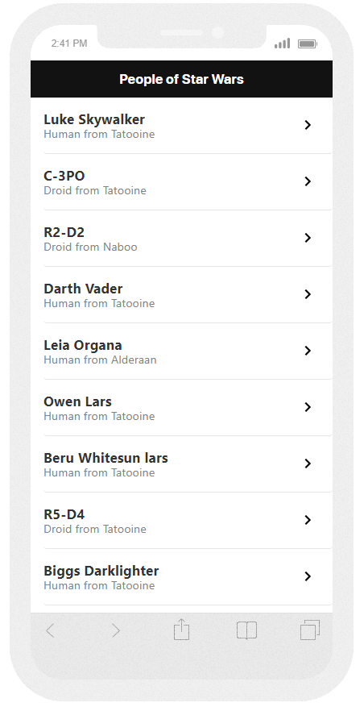

# Mobile web application of Star Wars 🌌🔫

## Index

- [1. About](#1-about)
- [2. Working application](#2-working-application)
- [3. Technologies used](#3-technologies-used)
- [4. Development server](#4-development-server)
- [5. Project link](#5-project-link)

---

## 1. About

Mobile web application that allows you to browse the Star Wars GraphQL Api and view main characteristics of the characters.

This project was generated with [Angular CLI](https://github.com/angular/angular-cli) version 11.0.4.

## 2. Working application

### List of characters

### Details of each character

## 3. Technologies used

- [x] [Angular]
- [x] [Bootstrap]
- [x] [SCSS]
- [x] [GraphQL]
- [x] [Apollo Client]

## 4. Development server

Run `ng serve` for a dev server. Navigate to `http://localhost:4200/`. The app will automatically reload if you change any of the source files.

## 5. Project link 🔗

Project Link : https://sheillyr.github.io/Ravn-Challenge-V2-Sheilly-Rodas/home
